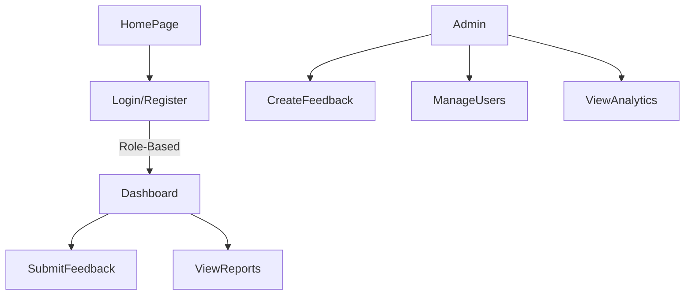

# 📊 KJSIT's Stakeholders Feedback Analysis Portal

## 🔍 Overview

KJSIT’s Stakeholders Feedback Analysis Portal is a centralized, web-based platform built to streamline the feedback process for stakeholders such as students, faculty, alumni, employees, and parents. Developed to support institutional accreditation processes (NBA and NAAC), this portal enables efficient collection, visualization, and analysis of stakeholder feedback using data visualization tools like **Power BI**.

🔗 [Live Demo](https://feedbackportal.kjsieit.in/)

---

## 🛠️ Features

- 🔐 **User Authentication**  
  Secure registration and login for all stakeholders.

- 📝 **Feedback Submission**  
  Stakeholders can view and submit feedback on their dashboard. Feedback is customized based on user roles.

- 🧑‍💼 **Admin Controls**  
  - Create/edit feedback forms  
  - Add questions/options (including image uploads)  
  - View submission reports and analysis  
  - Manage stakeholder accounts

- 📊 **Analytics Dashboard**  
  Dynamic Power BI integration for analyzing feedback based on:
  - Academic Year
  - Department
  - Division
  - Year of Study

- 🧾 **Report Generation**  
  Download reports in PDF/Excel format for record-keeping and evaluation.

---

## 👨‍💻 Technologies Used

| Technology        | Purpose                                  |
|-------------------|-------------------------------------------|
| **PHP**           | Backend development                      |
| **MySQL**         | Database management                      |
| **HTML/CSS/JS**   | Frontend development                     |
| **Power BI**      | Data visualization and analytics         |
| **Bootstrap**     | Responsive design and UI components      |

---

## 🔄 System Flow

---

## 👥 Stakeholders

- 🎓 Students  
- 👨‍🏫 Faculty  
- 🧑‍💼 Employees  
- 🧑‍🎓 Alumni  
- 👪 Parents  
- 🛠️ Admins

---

## 🧪 Achievements

- ✅ Deployed on KJSIT’s live server  
- 📈 1267 students registered and submitted feedback  
- 🧾 Feedback collected for:
  - Student Feedback on Curriculum  
  - Student Satisfaction Survey  
  - Program Exit Survey  

---

## 🧠 Future Scope

- Role-based access for academic peers  
- Feedback tracking over time  
- Notification system for unsubmitted feedback  
- Enhanced Power BI dashboards

---

## 📚 References

- [Power BI Documentation](https://learn.microsoft.com/en-us/training/powerplatform/power-bi)  
- [PHP Basics - Codecademy](https://www.codecademy.com/learn/learn-php)  
- [MySQL Docs](https://dev.mysql.com/doc/refman/8.0/en/)  

---

## 👨‍💻 Authors

- Kapil Sunil Bhatia
- Dakshita Sanjay Kolte  
- Palak Piyush Desai  
