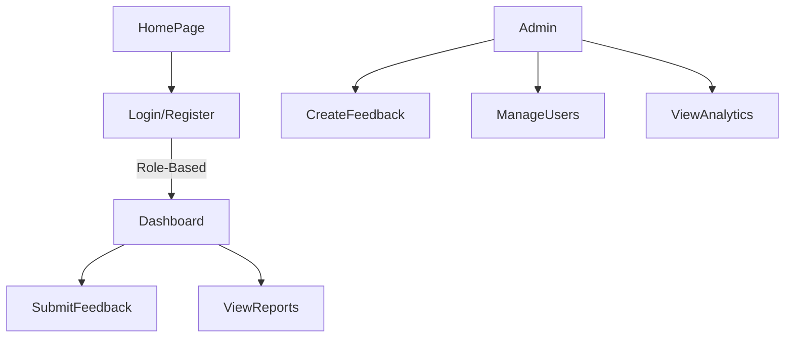

# KJSIT's Stakeholders Feedback Analysis Portal

## Overview

A Feedback Analysis Portal developed for K.J. Somaiya Institute of Technology (KJSIT) to collect and analyze feedback from key stakeholders - including students, faculty, parents, alumni, employers, and administrators. The system streamlines the feedback process and supports institutional accreditation from NBA and NAAC.
Integrated Power BI for automated report generation and insightful data visualization.

---

## Features

- User Authentication  
- Feedback Submission
- Admin Controls
  - Create/edit feedback forms  
  - Add questions/options (including image uploads)  
  - View submission reports and analysis  
  - Manage stakeholder accounts

- Analytics Dashboard using Power BI
- Report Generation
---

## Technologies Used

 &nbsp;
   &nbsp;
   &nbsp;
   &nbsp;

 &nbsp;
 &nbsp; 
 &nbsp; 

---
## Check Website
🔗 [Live Demo](https://feedbackportal.kjsieit.in/)

---

## 🔄 System Flow

---

## Stakeholders

- Students  
-  Faculty  
-  Employees  
-  Alumni  
-  Parents  
-  Admin
-  
 
